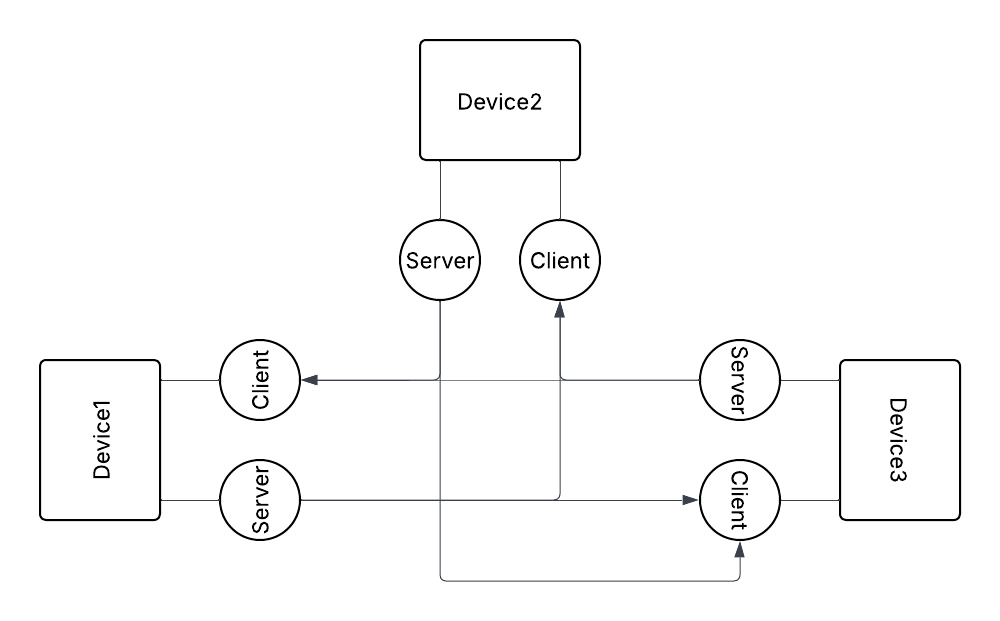

# MDCS (Multi Device Connectivity System)
> A system that enables seamless communication between multiple user devices, allowing remote command execution and coordination.

---

## Features (MVP)
### Common Clipboard
Synchronizes clipboard content across all connected devices in real-time, allowing seamless copy-paste between devices.

### File Sharing
Enables fast and secure transfer of files between connected devices without relying on third-party services.

### Open / Schedule Open Applications
Allows users to remotely open applications on connected devices instantly or schedule them for later execution.

### Process Scheduling
Provides the ability to schedule (periodically) the execution of tasks across devices in a controlled and sequential manner.

### Protocols
Framework for enabling/disabling system-level behaviors and security mechanisms.
- Kavach &rarr; A security protocol that allows users to protect sensitive data by encrypting and optionally moving it to secure storage (e.g., external devices).

### Folder Syncing
Keeps selected folders synchronized across multiple devices with automatic updates.

## Functional Decomposition
### Internal Modules (Dependencies):
- user_auth &rarr; Control user sign(in/up)
- device_auth &rarr; Control device registration/login
- device_mesh &rarr; Find/ping devices over the network
- command_exec &rarr; Execute user commands & map to respective services
- logging &rarr; Generate logs
- local_server &rarr; User level local server to communicate with other devices
- client &rarr; Separate command listener that constantly listens for commands from other servers

### Feature Modules (Micro-services):
- clipboard &rarr; Maintain common clipboard across devices
- file_share &rarr; Share the documents across the devices
- folder_sync &rarr; Sync the contents of the folder across devices
- protocols &rarr; Turn on/off the protocols across devices
- application_access &rarr; Access the applications on device(s) from other device(s)
- scheduler &rarr; Schedule or sequentialize applications over devices

## Folder Structure
`Changes are possible as the project evolves`
```
mdcs-monolith/
    apps/
        cli/
        server/
        gui/
    core/
        user_auth/
        device_auth/
        device_mesh/
        command_exec/
        local_server/
        client/
    assets/
    services/
        clipboard/
        file_share/
        folder_sync/
        protocols/
        application_access/
        scheduler/
    shared/
        logger/
        utils/
        configs/
        network/
```

## Architecture Overview
Follows Two-Layered architecture
### Application Level:
Every instance of application (A particular device running this application) will talk directly to the main server and which internally communicates with a database. Users generally don't interfere directly with this level of server, they just send requests at a specific nodes.

### User Level:
This level is for commuication among devices that user have opted in for access. The network of devices formed will communicate with each other through their own light-weight server and client modules, after all the required setup has been done.


### Workflow
```
CLI / GUI
    ↓
Command Router (command_exec)
    ↓
Service Layer (microservices)
    ↓
Network Layer (client / server)
    ↓
Target Device
```

### Communication Model
- CLI → Services  
  - Process execution / IPC (initially)

- Service ↔ Service (same device)  
  - Sockets / IPC

- Device ↔ Device  
  - Sockets (real-time communication)
  - HTTP

- App ↔ Main Server  
  - HTTP / HTTPS (authentication & metadata)

## Tech Stack (Planned)
- Languages:
    - C &rarr; Low-level system operations / performance-critical modules
    - Python &rarr; Prototyping, automation logic
    - Java &rarr; Business logic (+ GUI later)
    - Go &rarr; Networking services
- Networking:
    - Sockets &rarr; Internal modular communication
    - HTTP &rarr; Device level communications
- Tools: Git

## Getting Started
> Setup instructions will be added as the project evolves.

## Use Cases
MDCS is designed for users who want to improve productivity by managing and automating tasks across multiple devices.
- Control multiple personal devices from one interface
- Execute commands remotely
- Enable device-to-device communication system

## Current Status
- Initial development phase
- Core system under active development

## Future Plans
- Improve performance and optimize system efficiency
- Strengthen security mechanisms
- Transition to a microservices-based architecture

## Contributing
Currently a solo project. Contributions may be considered in the future.

## Development Roadmap
Will be updated as needed as project evolves

### Phase 1
- Basic CLI
- Device-to-device communication (sockets)

### Phase 2
- Command execution across devices

### Phase 3
- File sharing OR clipboard sync (first feature)

### Phase 4
- Device discovery (mesh formation)

### Phase 5
- Other micro-services

---