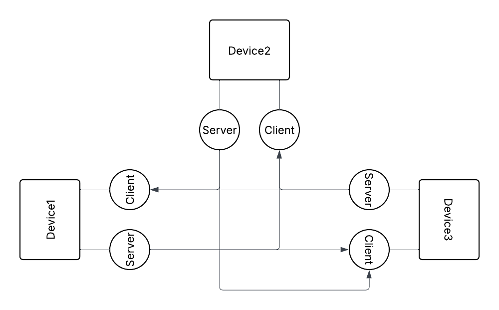

# Architecture Overview
Follows Two-Layered architecture

## Application Level:
Every instance of application (A particular device running this application) will talk directly to
the main server and which internally communicates with a database. Users generally don't interfere
directly with this level of server, they just send requests at a specific nodes.

## User Level:
This level is for commuication among devices that user have opted in for access. The network of 
devices formed will communicate with each other through their own light-weight server and client 
modules, after all the required setup has been done.


## Workflow

### Sending requests to a device
```
plugins / services
    ↓
  cient
    ↓
Target Device
```

### Receving and attending requests
```
Target Device
    ↓
host (command router)
    ↓
plugins / services
```

## Communication Model
- module &harr; service || service &harr; service || module &harr; module
    - Sockets / IPC

- Device ↔ Device
    - Sockets (real-time communication)
    - HTTP

- App ↔ Main Server
    - HTTP / HTTPS (authentication & metadata)

---